# MSSQL Docker Container

The purpose of this project is to walk you through the entire process of deploying a local SQL Server in a Docker container, and then using and analyzing its data in Excel. 

## Built With
Core technologies used in this project:

* 
* 
* 

<br />

# Getting Started 

## Part 1: SQL Management Studio and Database Restore Set-Up

### 1. Download .bak file and Create a new container
First, we'll set up a container using a Docker image. This container will run the preview version of Microsoft SQL Server 2022 on Ubuntu 22.04. To do this, just run this command:

```docker
docker run -e "ACCEPT_EULA=Y" -e "MSSQL_SA_PASSWORD=CSA103-StrongPassword" -e
"MSSQL_PID=Evaluation" -p 1433:1433 --name CSA103 --hostname CSA103 -d
mcr.microsoft.com/mssql/server:2022-preview-ubuntu-22.04
```
>Note that the password is **CSA103-StrongPassword** and the Port is **1433**

>After you execute the previous command, your container key (similar to this one: 3dc01d8030005a92ee8f88bc3f00e65f847e73756f3347d898eb571b0f281c3d) will be returned on your CLI. Make sure to store it somewhere accessible for later use.

Next, download the .bak file. You can find the **AdventureWorks2022.bak** file on this [link](https://learn.microsoft.com/en-us/sql/samples/adventureworks-install-configure?view=sql-server-ver16&tabs=ssms).

Once the download is complete, navigate to the folder where the **AdventureWorks2022.bak** file is located and run the following command (this will copy the .bak file into your container):

```docker
docker cp AdventureWorks2022.bak your_container_key_here:/var/opt/mssql/data
```
>Make sure you replace "your_container_key_here" with your container key that you saved in part 1

### 2. Start container
Once you execute the previous command, a new container will appear in your Docker Desktop app. If the container is not already running, you can start it by clicking on the "Start" button (See the image bellow)

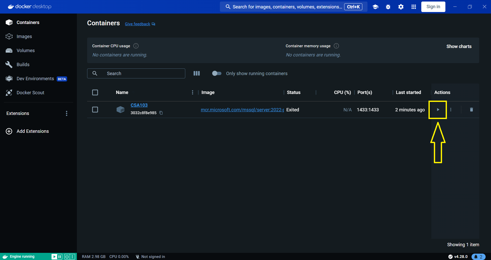

### 3. Connect to the server using Microsoft SQL Server Management Studio
Now that your container is up and running, use Microsoft SSMS to connect to your local SQL Server.

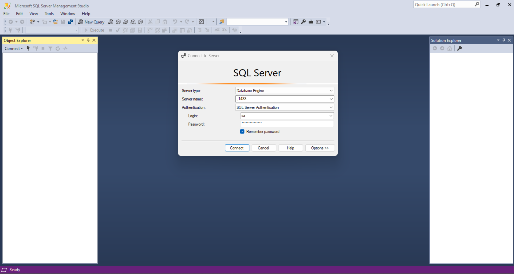

<blockquote>

Server Name: **,.1433** 

Login: **sa** 

Password: **CSA103-StrongPassword**
</blockquote>

### 4. Restore Adventure Works Database
Now, we need to restore the Adventure Works Database using a BACPAK file.

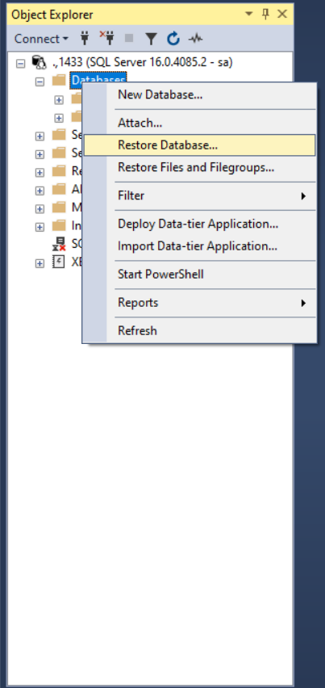 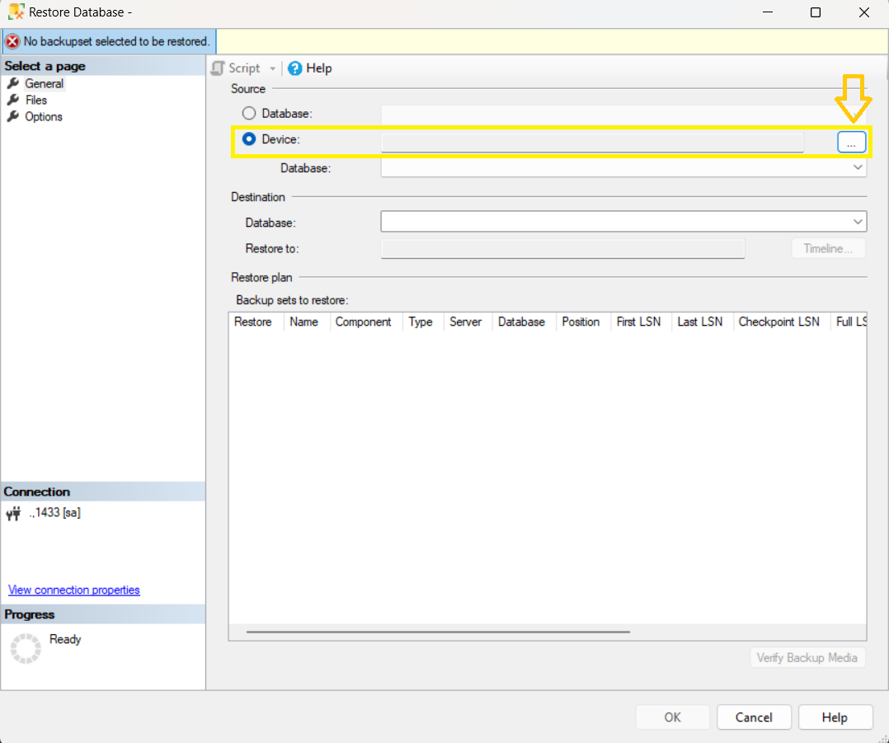 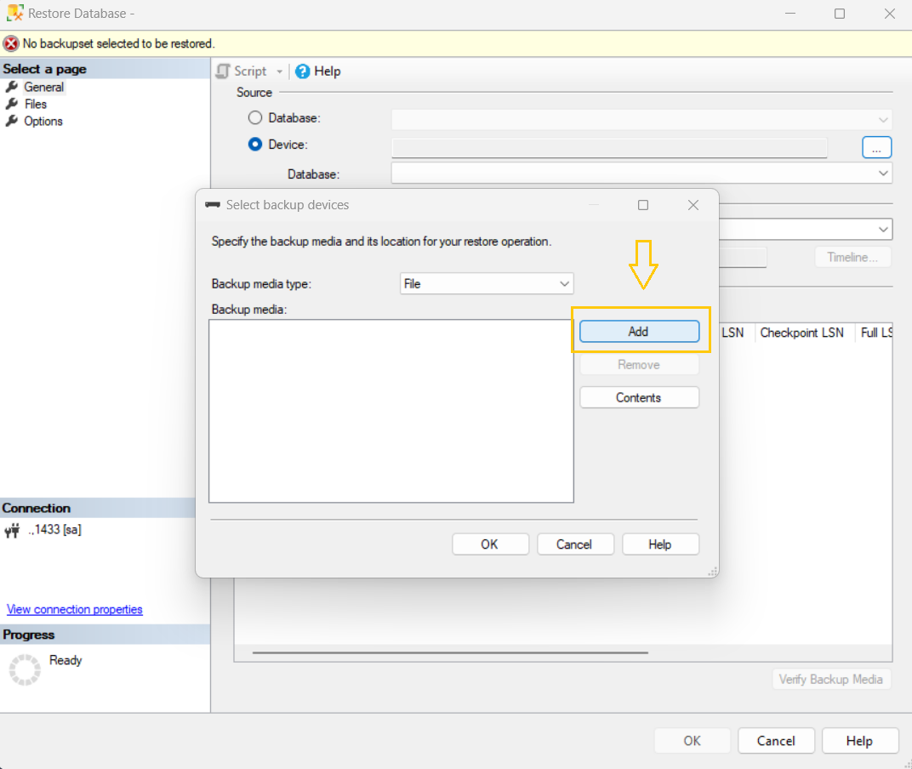 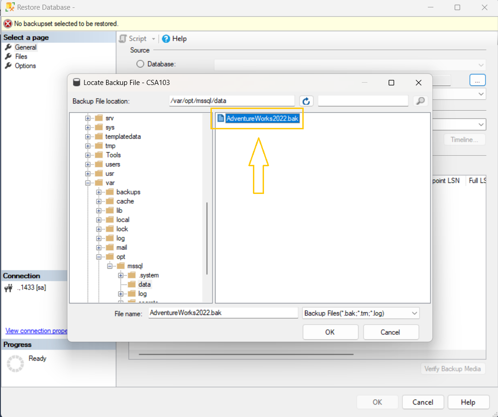

## :warning: Attention!! You need to check this box to be able to restore the database successfully.

Under the Files section you can find this option

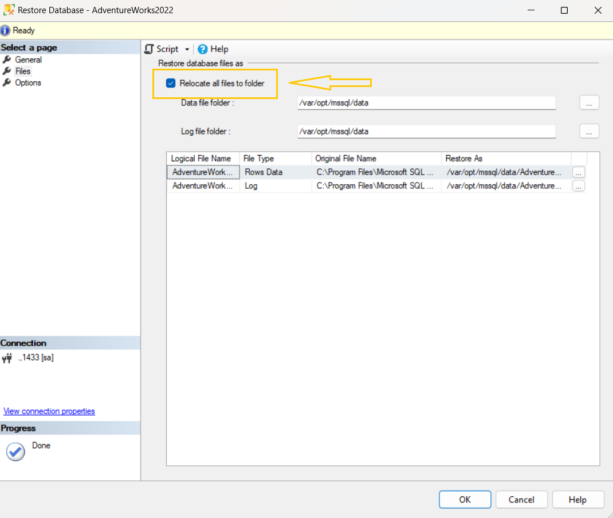

<br />

## Part 2: Importing and sanitizing data in Excel

It's time to transfer the data to Excel.

### 1. Import the Data

Open a new blank workbook and navigate to **Data** > **Get Data** > **From Database** > **From SQL Database**.

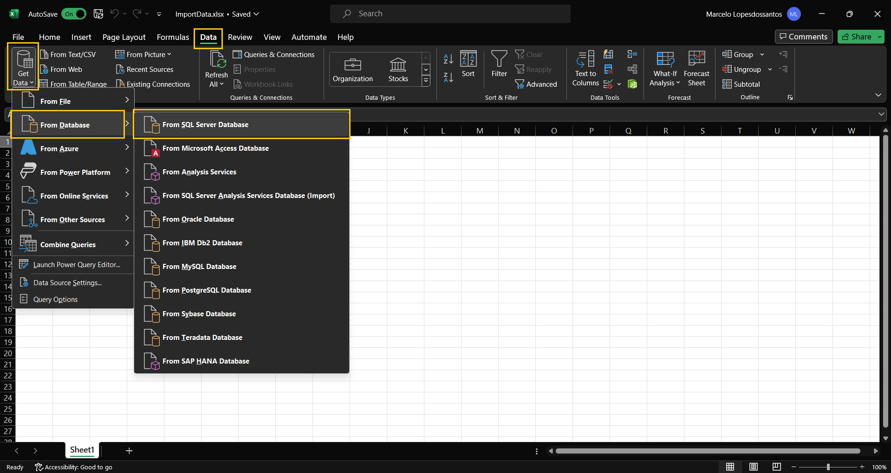

Type in the port number you used when creating your container. If you followed the steps in Part 1, the port should be **.,1433**.

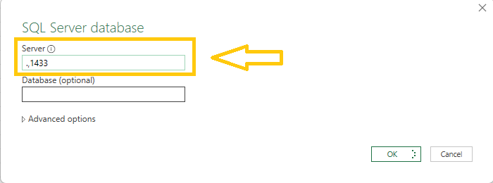

Enter the credentials:

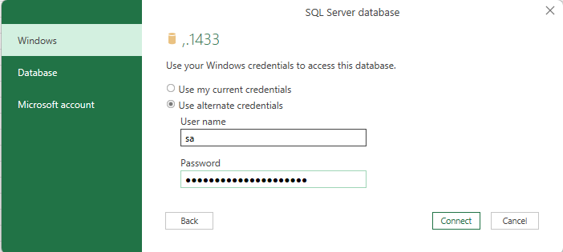

<blockquote>

Login: **sa** 

Password: **CSA103-StrongPassword**

</blockquote>

Select the following tables:

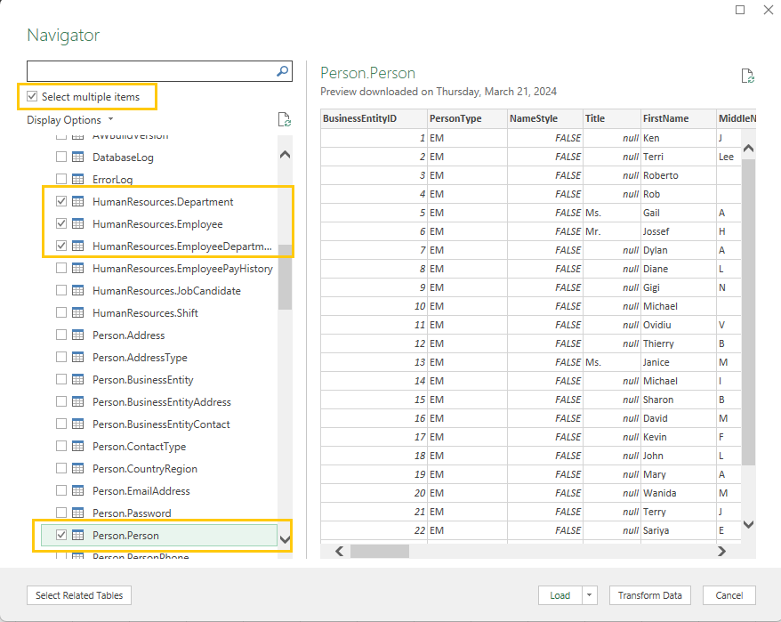

>**Be careful to not select the views**

>This is a view: **HumanResources.vEmployeeDepartment**

>This is a Table: **HumanResources.EmployeeDepartment** (Note that you don't have the "v" after the dot) 

Load the four tables into **different** worksheets:

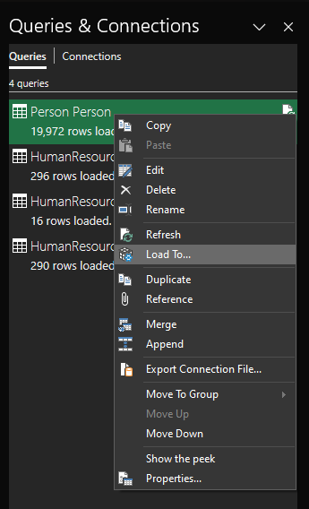

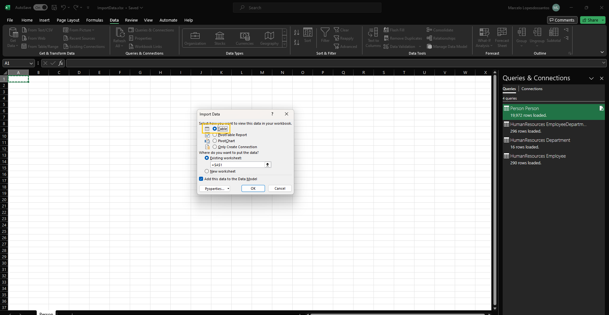

### 2. Clean the Data

Keep the following Columns:

**Person.Person:** BusinessEntityID, BusinessEntityID, LastName
**HumanResources.Employee:** BusinessEntityID, JobTitle
**HumanResources.EmployeeDepartment:** BusinessEntityID, DepartmentID, DepartmentName
**HumanResources.Department:** DepartmentID, Name

### 3. Solution

In the Person worksheet, add a new column named **IsEmployee** and paste the following statement into the first cell:

```excel
=IF(ISNUMBER(MATCH([@BusinessEntityID], Employee_TABLE[BusinessEntityID], 0)), "Employee", "Non-Employee")
```

Use the filter to display only the Employees. Your table should appear like this:

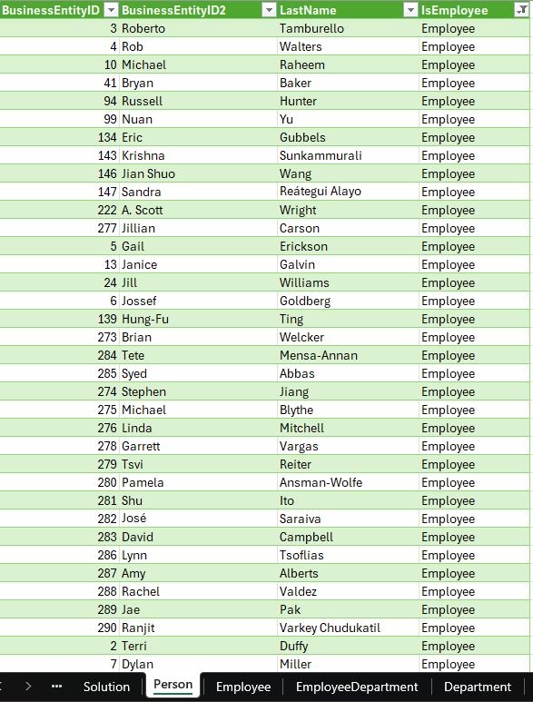

Copy this table to a new worksheet called **Solution**. Now you have a table containing only the employees (you can now delete the IsEmployee column as it is no longer relevant).

In the **Solution** worksheet create a now column named **Department** and use this statement:

```excel
=VLOOKUP(VLOOKUP([@BusinessEntityID],HumanResources_EmployeeDepartmentHistory,2,FALSE),HumanResources_Department,2)
```

Your table should look like this:

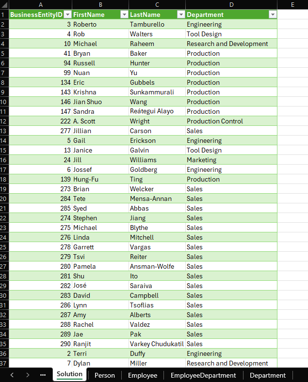

# :tada: Congratulations! You have reached the end of the project!